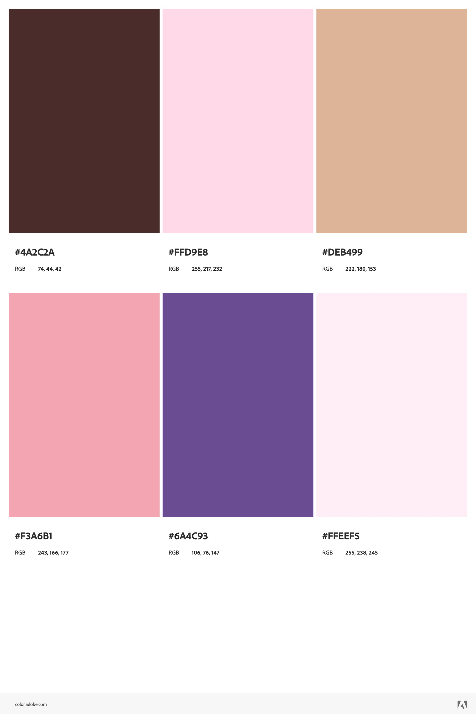

Hrithika Ravishankar
Render Link: https://hravishankar-a1-gettingstarted-a25.onrender.com

Notes:
- used W3Schools a lot to refresh on syntax

# ************************************
****** Design Achievements: ******
# ************************************
Color palette:

#4A2C2A
#FFD9E8
#DEB499 (for borders and lines)
#F3A6B1
#6A4C93
#FFEEF5

main color layout! used these colors and variations of these colors.

Font: 
- imported the "Hubballi" font from Google Fonts and applied it across the site

# ************************************
****** Technical Achievements: ******
# ************************************
Styled CSS page (style.css):
- body
    --> set a light purple background color (#f1effa) and used the Hubballi font from Google Fonts
    --> added padding around everything to make it look cleaner and increased the line spacing a bit so it’s easier to read
    --> changed font
- headings (h1, h2, h3)
    --> made them bigger and used a maroon color (#4a2c2a)
    --> added a line underneath the h2 and h3 headers with a light tan color to make the headers stand out
- section
    --> created a container to use for readability purposes/set contrast between background and text
    --> added a box shadow too (referenced W3Schools)
- list
    --> used a soft pink background
    --> created a border on the left of each list item
    --> added rounded corners (border-radius) for aesthetic purposes
- paragraph
    --> made paragraph text to be slightly bigger 

Styled JavaScript page (script.js):
- added a JavaScript animation that makes the main content of the page fade in when the page loads.
    --> to do this, I first set the opacity of the <section> to 0 in my CSS so it starts invisible
    --> In script.js, created a function called fadeInSection() that sets a transition on the opacity to make the fade smooth (like about 2s duration)
    --> i also used setTimeout() to delay this a bit more
    --> then, i set the opacity to 1 to trigger this change
    --> called the function with window.onload after so it runs when the page is fully loaded
*** Used w3schools to understand event listeners here

Completed HTML tags:
- Added a HEADER
- Added a FOOTER
--> For these I added a gradient to make them distinct from the rest of the content
- Added a LinkedIn LINK in the header
- Replaced the list for the experiences section with a TABLE to streamline content
- Added an IMAGE of the WPI logo in the footer
